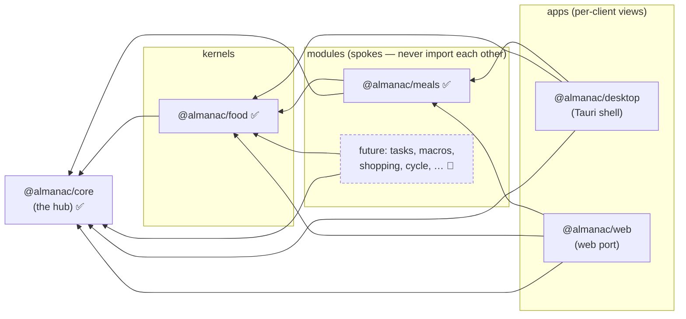
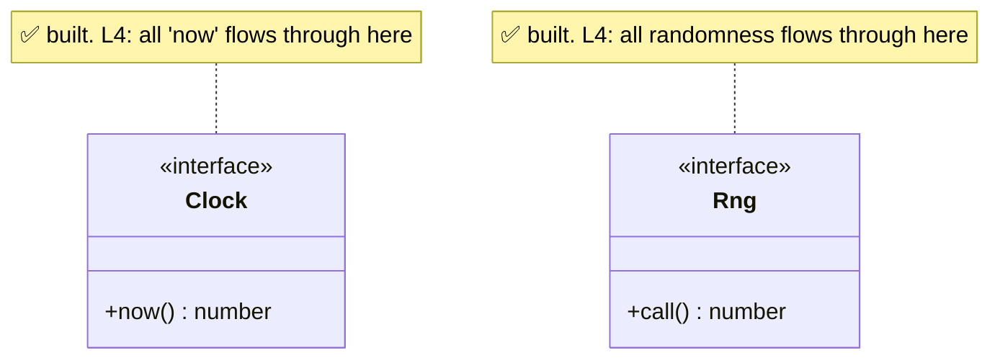
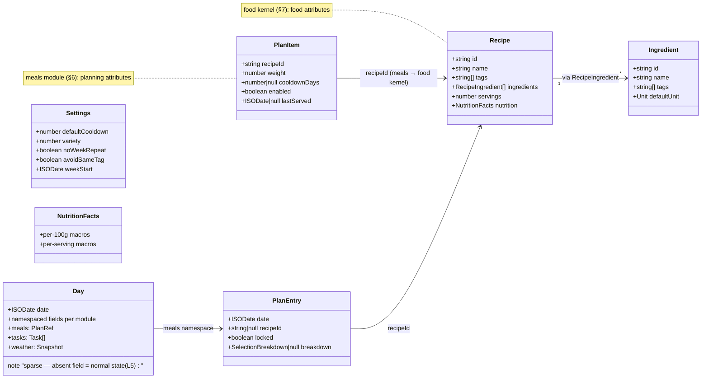
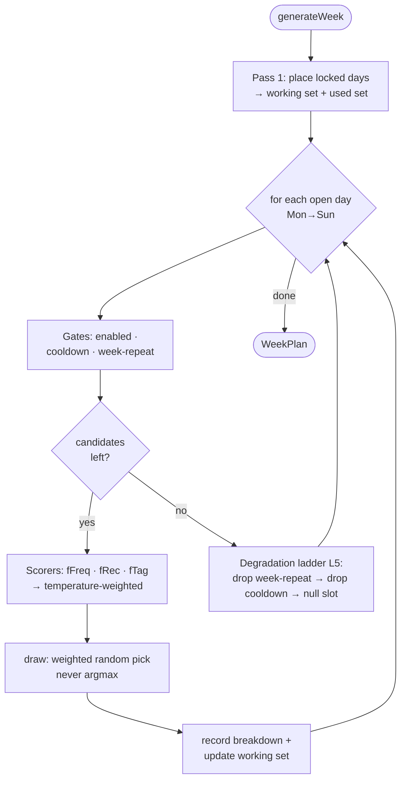

# Architecture

How Almanac is put together, and the laws that keep it that way. Diagrams are
[Mermaid](https://mermaid.js.org/) (GitHub renders them inline).

> **Legend for "built vs planned":** ✅ implemented today · 🔵 specified contract,
> not yet coded (design doc §5–§7). Phase 0 is a scaffold, so most domain types
> are still 🔵.

## The laws

Non-negotiable; enforced where possible (design doc §2).

- **L1 — Star modularity.** A module imports **core + kernels only, never another
  module.** Shared needs move *down*, never sideways. Enforced by the ESLint
  `boundaries` rule — a sibling import is a failed build.
- **L2 — Composition over inheritance.** No class hierarchies; rules/scorers/
  providers are plain functions or registered objects.
- **L3 — Pure, framework-agnostic core.** Core + module logic are plain TS, zero
  UI-framework deps. Dependencies point inward only.
- **L4 — Determinism by injection.** Randomness via an injected `Rng`, "now" via
  an injected `Clock`. No `Math.random()`/`Date.now()` in logic.
- **L5 — Graceful degradation, everywhere.** Every component has a defined, quiet,
  lower-capability state for missing/partial/erroring input. Failures isolate.
- **L6 — Locally-cached, server-durable (relaxed, D4).** On-device store for
  instant UI + offline; opt-in sync makes the server copy durable (per-slice
  LWW by revision).
- **L7 — i18n from day one.** No hardcoded strings; missing key → English.
- **L8 — Strict TypeScript.** `strict` + `noUncheckedIndexedAccess`; no `any`.

## Dependency star (component view)

Arrows read **"depends on"** and point strictly inward. This is the shape L1/L3
guarantee and the boundary lint enforces.

**Boundary matrix (lint-enforced):**

| Element | May import |
|---|---|
| `core` | nothing but itself |
| `kernels/*` | `core` |
| `modules/*` | `core`, `kernels/*` — **never another module** |
| `apps/*` | `core`, `kernels/*`, `modules/*` |

## Core ports (built) — the L4/L6 seams

Ports keep the core pure and testable; adapters live in kernels/apps.

Also built: **`StoragePort`** (read/write/remove/keys + optional batched
`readMany`), **`SyncPort`** (batch push / pull-since-revision per D4), and the
**`WeatherPort`** / **`NutritionPort`** contracts (adapters land with their
modules). Planned (ROADMAP P6): `NotificationPort`.

## Domain model (contract — 🔵 not yet implemented)

The shape the core + first module will take, per design doc §5 (day record), §6
(meal engine), §7 (food kernel). Shown so the target is legible while we build.

**Key seam:** a meal's *food* attributes live in the **food kernel** (`Recipe`);
its *planning* attributes live in the **meals module** (`PlanItem`), linked by
`recipeId`. That's why macros/shopping can reuse recipes without importing meals.

## Meal engine flow (contract — 🔵 Phase 4)

The one fully-specified algorithm (design doc §6). Sketch of `generateWeek`:

Determinism note (L4): identical state + different `Rng` seed ⇒ different weeks;
that's the anti-clustering property the statistical tests guard (design §12).

## What's actually built today

- **Core (Phase 1)** ✅ — time (`ISODate`, date math, fixed clock), seeded RNG,
  units (convert/normalize/combine), recurrence v1 (daily/weekly/monthly,
  interval/count/until, never-throws), sparse Day record + `DayStore` with
  isolated versioned slice codecs (+ batched range reads), calendar model
  (locale week-start grids, priority intensity scale), signal registry, i18n
  service, and the six port contracts.
- **Web renderer (Phase 2)** ✅ — design tokens (system light+dark),
  month/week/day views + switcher, keyboard-first grid
  (`aria-activedescendant` roving selection), EN/CS via react-i18next,
  `localStorage` `StoragePort`, Zustand store, demo "star a day" slice
  exercising the full Day pipeline. 51 tests.
- **Tauri shell** 🔨 — compiles with icons; native (SQLite) `StoragePort`
  pending.
- The **food kernel and meals engine** classes above remain 🔵 (Phases 3–4).

Phase-by-phase narrative: [BUILD_JOURNAL.md](BUILD_JOURNAL.md) · sequence:
[ROADMAP.md](ROADMAP.md).
